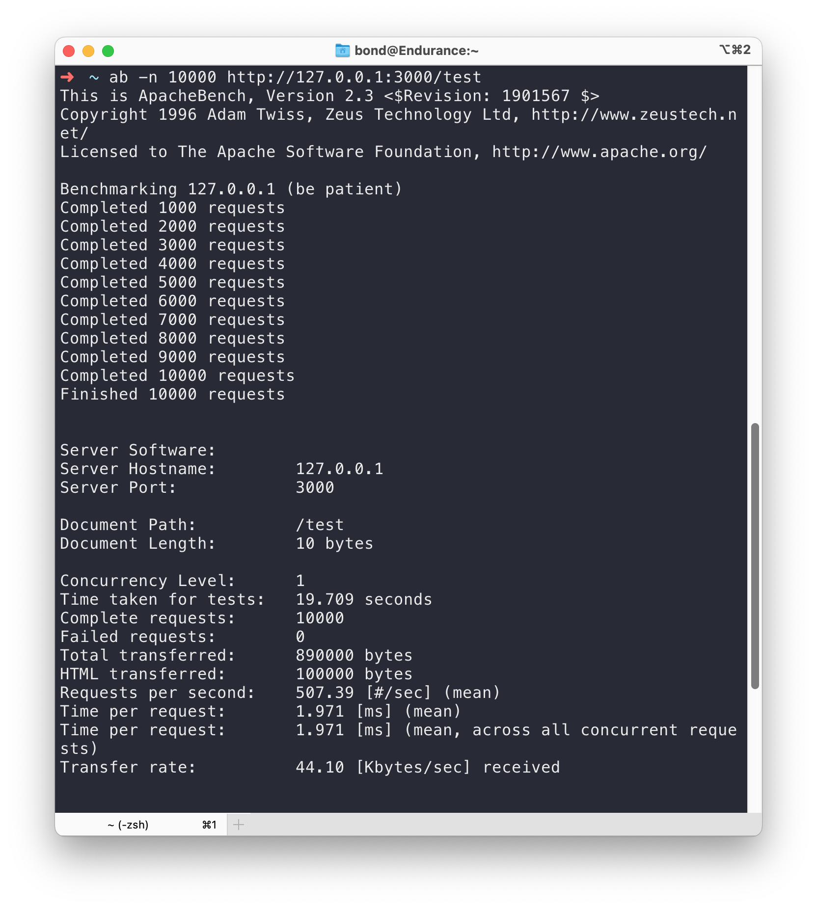
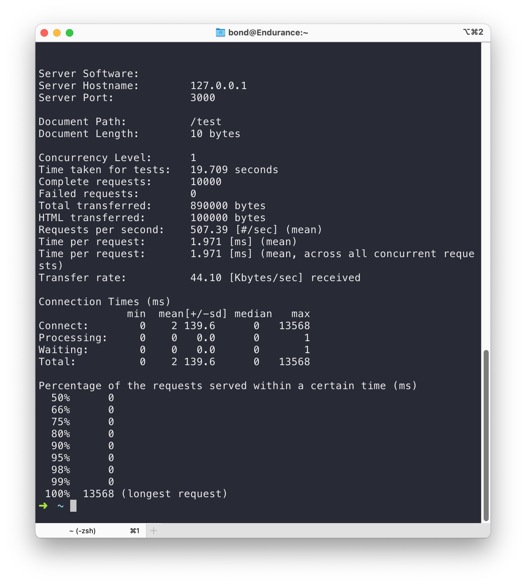

# Bun Bun Bun

> Let's try this.

## Bun Server Performance Testing

```sh
ab -n 100 http://127.0.0.1:3000
```

part-1


part-2



## Misc

- [Bun benchmark test in 2023-09-15](https://github.com/shrekuu/try-bun-2023)
